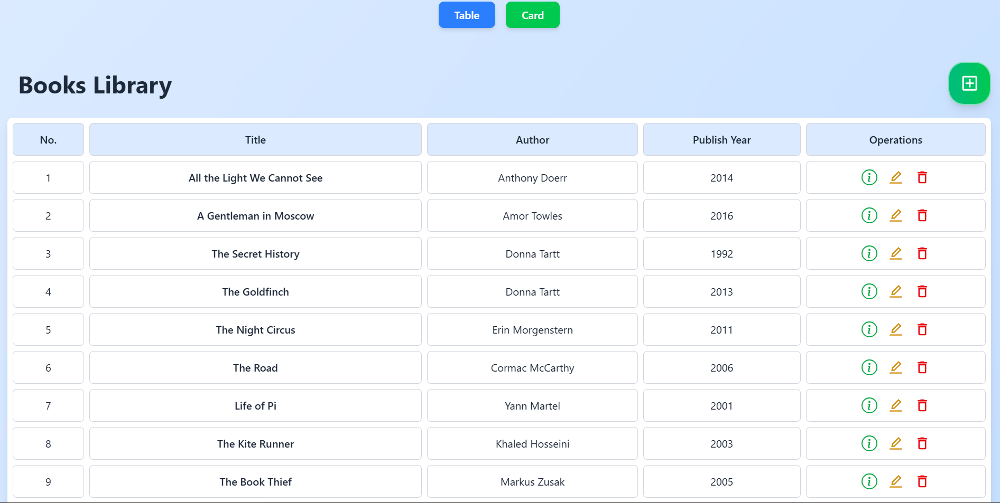

# 📚 Book Store - MERN Stack

A full-stack book management system with beautiful UI and complete CRUD operations.



## 🛠️ Tech Stack

- **Frontend**: React + Vite + Tailwind CSS
- **Backend**: Node.js + Express + MongoDB

## ✨ Features

- ✅ Add, view, edit, delete books
- ✅ Beautiful responsive design with light blue theme
- ✅ Table and card view modes
- ✅ Modal popups for book details
- ✅ Toast notifications

## 🚀 Quick Start

### Backend

```bash
cd backend
npm install
# Create .env file with MONGO_DB_URI and PORT
npm start
```

### Frontend

```bash
cd frontend
npm install
npm run dev
```

Open `http://localhost:5173`

## 📱 Screenshots

- Home page with gradient background
- Book cards with glass-morphism design
- CRUD forms with modern styling

## 🔗 API Endpoints

- `GET /books` - Get all books
- `POST /books` - Create book
- `PUT /books/:id` - Update book
- `DELETE /books/:id` - Delete book

---

Made with ❤️ by [obishake](https://book-store-frontend-sltx.onrender.com/)
